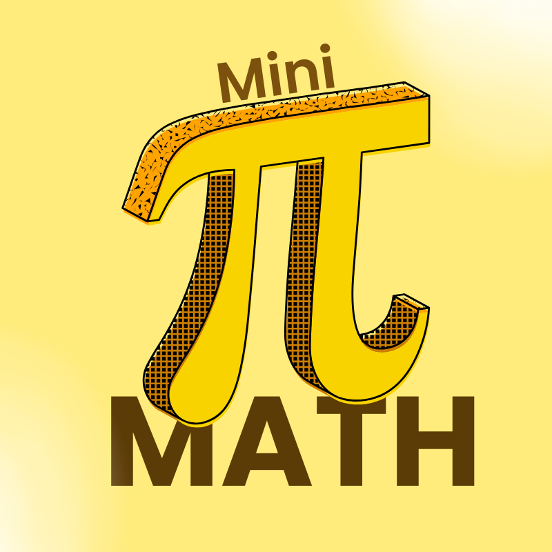

<div align="center">
  
  <h1 align="center">MiniMath</h1>
  <i>minimath is a lightweight, pure-Python library for performing basic mathematical operations and utilities. It provides essential functions ranging from basic arithmetic to algebra and geometry, all implemented without any external libraries like math or numpy</i>
  <br>
  <br>
    
</div>

## Installation
```
pip install git+https://github.com/CYCNO/minimath.git
```

## Features

### 🔹 Basic Functions
- **`factorial(n)`**: Calculate the factorial of a number `n`.
- **`fibonacci(n)`**: Find the nth Fibonacci number.
- **`gcd(a, b)`**: Calculate the greatest common divisor (GCD).
- **`lcm(a, b)`**: Calculate the least common multiple (LCM).
- **`is_prime(n)`**: Check if a number `n` is prime.
- **`primes_upto(n)`**: Generate all primes ≤ `n`.
- **`digit_sum(n)`**: Calculate the sum of the digits of `n`.
- **`nCr(n, r)`**: Calculate combinations of `n` items taken `r` at a time.
- **`nPr(n, r)`**: Calculate permutations of `n` items taken `r` at a time.

### 🔹 Algebra / Functions
- **`quadratic_roots(a, b, c)`**: Solve the quadratic equation `ax² + bx + c = 0`.

### 🔹 Geometry
- **`distance(p1, p2)`**: Calculate the Euclidean distance between points `p1` and `p2`.
- **`triangle_area(a, b, c)`**: Calculate the area of a triangle using Heron's formula.
- **`circle_area(r)`**: Calculate the area of a circle with radius `r`.

### 🔹 Linear Algebra (Matrices)
- **`Matrix(rows, columns)`**: Initialize a matrix using dimensions or an existing 2D list.
- **`fill(value)`**: Fill the entire matrix with a specified scalar value.
- **Matrix Addition (`+`)**: Add two matrices together or add a scalar to a matrix.
- **Matrix Multiplication (`*`)**: Multiply two matrices (dot product) or multiply a matrix by a scalar.

### 🔹 Constants
- **`pi()`**: Returns First 10 Digits of pi.
- **`e()`**: Returns First 10 Digits of e.

### Basic Usage
```py
from minimath import MiniMath

mm = MiniMath()

# Basic Functions
print(mm.factorial(5))          # 120
print(mm.fibonacci(10))         # 55
print(mm.gcd(24, 36))           # 12
print(mm.lcm(4, 6))             # 12
print(mm.is_prime(7))           # True
print(mm.primes_upto(20))       # [2, 3, 5, 7, 11, 13, 17, 19]

# Number Utilities
print(mm.digit_sum(123))        # 6
print(mm.nCr(5, 2))             # 10
print(mm.nPr(5, 2))             # 20

# Algebra / Functions
print(mm.quadratic_roots(1, -3, 2))      # [2.0, 1.0]

# Geometry
print(mm.distance((0, 0), (3, 4)))        # 5.0
print(mm.triangle_area(3, 4, 5))          # 6.0
print(mm.circle_area(5))                  # 78.53981633974483
print(mm.circle_circumference(5))         # 31.41592653589793
```

### Matrix
```py
# Linear Algebra (Matrices)
from minimath import Matrix

# Creating matrices
A = Matrix(2, 2)
A.fill(2)

B = Matrix([[1, 2], [3, 4]])

# Scalar operations
print(A + 5)
# Output:
# [7, 7]
# [7, 7]

print(B * 2)
# Output:
# [2, 4]
# [6, 8]

# Matrix operations
print(A + B) # or Matrix.add(A, B)
# Output:
# [3, 4]
# [5, 6]

print(A * B) # or Matrix.multiply(A, B)
# Output:
# [8, 12]
# [8, 12]

# Get Index Value
print(B[0][1])  
# Output: 2
```
## Reporting Issues

<details>
  <summary>Click to view instructions for reporting issues</summary>

1. **Check Existing Issues**: Before creating a new issue, check if it’s already reported by searching through the [issues page](https://github.com/CYCNO/minimath/issues).

2. **Create a New Issue**: If the issue isn’t listed, click on **New Issue** and provide:
   - A clear description of the problem.
   - Steps to reproduce the issue.
   - Expected and actual results.
   - Any relevant code snippets or error messages.

We appreciate your help in improving **minimath**!

</details>


## Contribution Guide
<details>
  <summary>Click to view instructions for reporting issues</summary>

We welcome contributions to **minimath**! To add a new function:

1. **Create a New Module/Class**: If your function doesn’t fit into existing categories (e.g., basic, algebra, geometry), create a new file and class.

   Example: `number_theory.py`, and a `NumberTheory` class.

2. **Update `MiniMath`**: After adding a new class, update the `MiniMath` class in `minimath.py` to import your new class:
   ```python
   from .basic import Basic
   from .algebra import Algebra
   from .geometry import Geometry
   from .your_new_module import YourNewClass

   class MiniMath(Basic, Algebra, Geometry, YourNewClass):
       pass
       ```
3. **Create a Pull Request** : Fork the repo, create a branch for your changes, and submit a pull request.

</details>

## Changelog
<details>
<summary>Updates</summary>
v0.2.0:
added matrix
</details>

## License
- MIT
